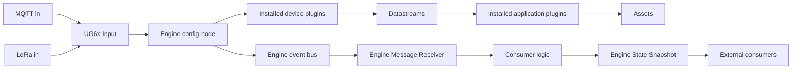

# Real-Time Insight Engine Architecture

## 1. Goals

The new implementation should:

- preserve the current domain model: devices own datastreams, assets own applications, and applications consume mapped datastreams;
- be written and tested in TypeScript outside the Node-RED editor;
- be versioned and released through Git and npm;
- install only the device and application implementations required by a gateway;
- expose deployment-specific settings in the Node-RED editor without rebuilding the core package;
- use Node-RED lifecycle, context storage, status, and message conventions;
- run reliably on the resource-constrained Milesight UG65;
- emit unified Node-RED messages and provide read-only state access without depending on any particular downstream consumer.

The existing files in `old_code` should initially be treated as behavior to preserve, not as the final package structure.

The confirmed target is Node-RED 3.0.2 on Node.js 18 with npm 6.14.9. On Milesight gateways the Node-RED installation is rooted at `/etc/node_red`; it contains `settings.js`, `node_red.json`, and `node_red_nginx.sh`. The Node-RED user directory is `/etc/node_red/data`, containing `flows.json`, `lib/`, `node_modules/`, `package.json`, and `package-lock.json`.

Develop this project as a normal Node-RED npm package compatible with those versions. Transporting the package to a gateway and choosing the final installation procedure are deployment concerns, not blockers for the software architecture.

The production design permits one active engine per Node-RED runtime. Multiple engines in the same Node.js process would provide configuration isolation but would not distribute CPU work. Worker threads are not justified for the expected minute-scale input and application intervals; consider them only if measurements later show CPU-bound calculations blocking the Node-RED event loop.

## 2. Recommended Shape

Use three layers:

1. A framework-independent TypeScript domain/runtime library.
2. Independently installable device and application plugin packages.
3. A small Node-RED integration package containing custom nodes.



The domain library must not import Node-RED. The Node-RED package adapts messages, context, timers, and logging to the domain library. This makes the calculation code easy to test with a normal debugger and keeps Node-RED-specific concerns at the boundary.

  The package is consumer-agnostic. Likely consumers include industrial protocols, dashboards, logging flows, and future integrations, but their mappings and payload formats are outside this package.

## 3. Package Layout

A monorepo is convenient for development, but each plugin should remain a separate package boundary so a deployment includes only what it needs. npm workspaces may be used on development and CI machines; npm 6.14.9 on the gateway does not support workspaces and receives only built npm artifacts.

```text
packages/
  core/
    src/
      engine.ts
      application.ts
      asset.ts
      device.ts
      datastream.ts
      events.ts
      diagnostics.ts
      config.ts
      state-store.ts
  node-red/
    src/
      engine-config.ts
      ug6x-input-node.ts
      engine-message-receiver.ts
      engine-state-snapshot.ts
    nodes/
      engine-config.html
      ug6x-input-node.html
      engine-message-receiver.html
      engine-state-snapshot.html
  device-enless-twin-temp/
    src/index.ts
  app-twin-temp-failed-closed/
    src/index.ts
  deployment-ug65-example/
    package.json
    settings.example.json
```

Possible published package names are:

- `@sxs/industrial-core`
- `node-red-contrib-sxs-industrial`
- `@sxs/device-enless-twin-temp`
- `@sxs/app-twin-temp-failed-closed`

Publish a standard Node-RED integration package plus separate core and plugin packages. A small optional **gateway profile package** can depend on the integration package and exactly the required plugins. For example, a profile needing applications 1, 6, and 8 includes only those three application packages. It is mostly a package manifest and explicit plugin registry, and pins a tested combination of versions for a gateway/customer.

The source can stay in one Git monorepo while the build produces ordinary npm artifacts. Keep production dependencies minimal and pure JavaScript where possible; avoid native addons and installation scripts unless a demonstrated requirement justifies them.

Do not create one Node-RED node type per application instance or asset. Applications and devices are domain plugins configured through the engine; Node-RED nodes are integration endpoints.

## 4. Plugin Model and Dynamic Loading

Dynamic selection and dynamic installation are different concerns:

- **Selection at runtime:** the JSON configuration chooses which registered plugin types to instantiate. This should be dynamic.
- **Installation for a deployment:** npm installs a tested set of packages, optionally represented by a gateway profile containing only the required plugins. This should be explicit and versioned.

An explicit registry generated in the integration or gateway profile package is the primary recommendation. It avoids resolving an arbitrary package name supplied in configuration. Adding application 9 means installing a package/profile that includes application 9, then selecting its type ID in the configuration; it does not mean rebuilding the core or bundling all applications.

Each plugin package should export a manifest and a factory/class. A simplified contract could be:

```ts
export interface ApplicationPlugin<TSettings, TState> {
  kind: "application";
  type: string;                    // Stable ID, e.g. "sxs.twin-temp-failed-closed"
  version: number;                 // Configuration/state contract version
  displayName: string;
  requiredDatafeeds: readonly string[];
  settingsSchema: JsonSchema;
  defaultSettings: TSettings;
  create(context: ApplicationContext<TSettings, TState>): Application;
}

export interface DevicePlugin<TSettings, TState> {
  kind: "device";
  type: string;                    // Stable ID, e.g. "sxs.enless-twin-temp"
  version: number;
  displayName: string;
  datastreams: readonly string[];
  settingsSchema: JsonSchema;
  defaultSettings: TSettings;
  create(context: DeviceContext<TSettings, TState>): Device;
}
```

The Node-RED engine configuration stores stable type IDs as data; the profile registry maps those IDs to installed implementations:

```json
{
  "devices": {
    "device-1": {
      "type": "sxs.enless-twin-temp",
      "datastreams": {
        "temp1": { "maxBufferLength": 6, "maxBufferAgeMs": 60000, "expectedIntervalMs": 10000 },
        "temp2": { "maxBufferLength": 6, "maxBufferAgeMs": 60000, "expectedIntervalMs": 10000 }
      }
    }
  },
  "assets": {
    "trap-1": {
      "applications": [
        {
          "id": "failed-closed",
          "type": "sxs.twin-temp-failed-closed",
          "runIntervalMs": 120000,
          "settings": {
            "tempDiffMargin": 0.4,
            "offThreshold": 70,
            "tempDiffThreshold": 40,
            "windowSizeMs": 180000
          },
          "datafeeds": {
            "tempIn": "device-1/temp1",
            "tempOut": "device-1/temp2"
          }
        }
      ]
    }
  }
}
```

At startup, the profile registers its included manifests, and the engine constructs only the types selected in JSON. Fail startup on duplicate type IDs, unavailable types, incompatible versions, invalid settings, or unresolved datastream mappings.

For security and predictable deployments:

- include plugins only through installed, versioned npm package dependencies;
- generate or hand-maintain an explicit type registry in that profile;
- do not use `eval`, `new Function`, or arbitrary JavaScript pasted into configuration;
- do not recursively scan the file system for plugins;
- pin plugin versions in `package-lock.json` and build/deploy from Git tags or CI artifacts.

Separately installable plugin packages can be explored later if each package can participate through a documented registration contract. Do not depend on private Node-RED internals or a process-global registry for the first version. An explicit registry remains predictable on Node-RED 3.0.2 and solves the important requirement: a deployment does not carry all 50 applications and 30 device types.

## 5. Node-RED Nodes

### Engine config node

Create a Node-RED configuration node similar in role to a shared connection configuration. It owns exactly one `Engine` instance and provides it to the regular nodes that reference it.

Responsibilities:

- parse and validate deployment configuration;
- load registered plugins;
- construct devices, datastreams, assets, and applications;
- restore and periodically persist state;
- own the application and stale-datastream schedulers;
- own an engine-scoped typed event bus and a read-only instance registry;
- expose authoritative lifecycle state and publish replayable readiness transitions;
- stop timers, flush state, and remove listeners when Node-RED closes or redeploys.

Avoid process-wide static `instanceMap` objects in the new core. Maps should belong to an `Engine` instance. Static maps leak instances across partial Node-RED redeploys and prevent two independent engines from running in one process.

### UG6x Input node

This is the only gateway-specific node in the package. It receives messages from LoRaWAN and built-in UG65/UG67/EG71 inputs and references one engine config node.

Recommended properties:

- engine;
- `msg.deviceName` as the canonical device ID;
- `msg.gatewayTime` as the canonical source timestamp;
- behavior for unknown devices: warn/drop or send to an error output.

For all Milesight sources, `msg.gatewayTime` is an ISO 8601 string such as `2026-08-21T15:19:25+02:00`. The node validates it, converts it once to Unix epoch milliseconds, constructs a normalized ingestion envelope, and calls the Engine's public API:

```ts
interface IngestEnvelope {
  deviceId?: string;
  sourceTs: number;
  receivedTs: number;
  source: "ug6x";
  rawPayload: unknown;
  issues: Array<"NO_DEVICE_NAME" | "NO_GATEWAY_TIME" | "INVALID_GATEWAY_TIME">;
}
```

All timestamps inside the engine, persisted state, and emitted events use Unix epoch milliseconds. The original source timestamp string may be retained as event metadata for diagnostics.

Treat `deviceName` and `gatewayTime` as top-level fields with exactly those names. If `gatewayTime` is absent or cannot be parsed, use `receivedTs` as the sample timestamp and include the corresponding issue in the envelope.

The UG6x node handles only gateway-envelope validation and normalization. It does not know device plugin decoding rules and does not access the event bus directly. The Engine receives the envelope, performs registry lookup, raises/reconciles diagnostics, dispatches `rawPayload` to the configured device plugin, mutates state, and publishes resulting events. This keeps a single authority for event ordering, persistence, and diagnostic lifecycle.

Payload interpretation remains device-specific:

- a LoRaWAN plugin can read decoded numeric datafeeds such as `msg.object.temp1` and handle sentinel values such as `3272.7` as hardware faults;
- an EG71 universal-input plugin can recognize `msg.object.objectName` and obtain the value from the named top-level property, such as `msg["Present Value"]`.

This keeps LoRaWAN and built-in I/O decoding out of the adapter and the Engine core. The Engine is transport-agnostic: it understands the normalized envelope and plugin registry, while each plugin understands its device payload. Device names may be renamed by the gateway where Milesight supports it; the engine treats the incoming name as the configured lookup key.

If `deviceName` is absent or does not match a configured device, the Engine does not attempt plugin parsing. It raises or updates a Common diagnostic such as `DEVICE_NOT_RECOGNIZED` because no Device instance can own the condition. If the device is known but gateway time is missing or invalid, the Engine raises a Device diagnostic such as `NO_GATEWAY_TIME`; the next valid payload reconciles and clears it. Repeated malformed-input diagnostics should be rate-limited or summarized so a bad source cannot flood logs or flash storage.

The node is justified even though common validation is small: it isolates Milesight-specific field names and future gateway quirks, provides Node-RED status/error behavior, and prevents those details from entering the reusable core. Use `node.status()` to show ready, last input, or configuration error states. Pass unexpected adapter failures to `done(error)`; rejected payloads are expected Engine diagnostics rather than JavaScript exceptions.

### Engine Message Receiver node

Retain the event-bus idea. It provides useful decoupling: domain instances publish events without knowing which subscribers exist. The change is to scope the bus to an `Engine`, rather than using one process-global singleton, and to provide a Node-RED adapter at its boundary.

The Engine Message Receiver references an engine, subscribes to event-name patterns, and emits all matching events through **one output**. Its editor can accept patterns such as `entity.updated`, `diagnostic.*`, or `*`. A Switch node can route by `msg.topic` or `msg.event.type` when routing is wanted. Multiple receiver nodes may subscribe independently to the same engine, so each downstream subsystem can choose its own filter.

Like a node referencing an MQTT broker configuration, a receiver on any flow tab can reference the single engine config node. Consumer-specific mapping remains in downstream Function or custom nodes and is deliberately not part of this package.

This avoids the "octopus" problem. Adding a new event type does not add an output or change the node contract. Existing subscribers ignore it unless their pattern includes it.

Use a stable, lightweight event envelope. The receiver converts the internal event to a standard Node-RED `msg` but does not query or attach entity state:

```json
{
  "topic": "entity.updated",
  "event": {
    "type": "entity.updated",
    "timestamp": 1788100000000,
    "source": {
      "engineId": "insight-engine-1",
      "entityType": "application",
      "entityId": "trap-1/failed-closed",
      "pluginType": "sxs.twin-temp-failed-closed"
    }
  }
}
```

Do not put a live `Device`, `Datastream`, `Application`, or `Asset` object on `msg`. Node-RED may clone messages, and a live object exposes methods, parent links, mutable state, timers, and circular references. It also lets an unrelated flow mutate the engine accidentally.

Event-specific `data` is allowed only where the event cannot be understood without it, for example diagnostic code and lifecycle. State, buffers, settings, parent state, and child state are never attached to ordinary events. The receiver may filter by event type and source identity, but it does not perform state projection.

Instances may publish typed domain events freely through their injected `EventSink`; they do not import the bus, construct Node-RED messages, know subscribers, or maintain a `logPayload` containing explicit `null` clears. The Engine commits state before forwarding events to its bus, so a consumer reacting to an event can always request the corresponding committed snapshot.

To tame bursts without coupling producers to consumers, Engine Message Receiver supports two delivery policies per receiver:

- **Immediate:** forward each matching event in order. This is mandatory for `engine.lifecycle`, `engine.ready`, `diagnostic.raised`, `diagnostic.cleared`, and material `diagnostic.updated` events.
- **Coalesced:** for coalescible events such as `entity.updated`, retain only the latest event for each `(event.type, source.entityType, source.entityId)` during a short trailing window. Start with 100 ms and enforce a 500 ms maximum latency so continuous updates cannot postpone delivery indefinitely.

`diagnostic.updated` is emitted only for a material change in severity, message, or details; observing the identical active condition again may update internal `lastObservedTs` and occurrence count without publishing another event. Receivers may additionally rate-limit repeated non-state telemetry, but they must never invent diagnostic clears or maintain the authoritative diagnostic registry. Reconciliation remains Engine-owned because it must be identical for every receiver, persisted once, and available through snapshots even when no receiver exists.

### Engine State Snapshot node

This regular request/response node references the same Engine config node, has one input and one output, and provides read-only access to serializable Engine views. It preserves the incoming message, including `_msgid` and `event`, attaches the result to `msg.snapshot`, then sends that same message onward. This supports the flow:

```text
Engine Message Receiver -> request logic -> Engine State Snapshot -> consumer logic
```

For common fixed queries, the request can be configured directly in the node editor, avoiding the first Function node. A dynamic `msg.snapshotRequest` overrides those defaults. The initial request contract should support:

```ts
interface SnapshotRequest {
  target:
    | { scope: "eventSource" }
    | { scope: "entity"; entityType: EntityType; entityId: string }
    | { scope: "all" };
  relations?: "self" | "parent" | "children" | "family";
  statePaths?: string[]; // Omit for complete state.
  strictPaths?: boolean; // Default false.
}
```

`eventSource` resolves `msg.event.source`; `entity` performs an explicit lookup; `all` returns every Device, Datastream, Application, and Asset view. `family` includes the selected entity plus direct parent and children. The response contains identities, relationship references, plugin type, and either complete states or the requested state paths. Use simple validated dotted paths rather than executing arbitrary JSONata or JavaScript in the core.

A requested state path absent from an otherwise valid entity is omitted from that entity's projected state and reported in `msg.snapshot.missingPaths`, including the entity reference and path. This is not the same as a missing plugin: a configured plugin type that is not registered fails Engine startup before readiness. With `strictPaths = true`, any missing path fails the Snapshot request through `done(error)` and produces no partial output; use strict mode for consumers whose contract requires every requested value.

Every response is a deep serializable copy/DTO. It contains no methods, timers, event emitters, or mutable references to Engine objects. A missing entity or invalid request is passed to `done(error)` and does not mutate Engine state.

### Engine readiness and Gatekeeper flows

Readiness is a level state owned by the Engine, not only a one-time event. The Engine exposes `isReady` internally and has a lifecycle state of `starting`, `ready`, `resetting`, `failed`, or `stopping`. Only `ready` maps to `isReady = true`.

Every lifecycle transition is published on the internal bus and converted by Engine Message Receiver to a lightweight message:

```json
{
  "topic": "engine.lifecycle",
  "event": {
    "type": "engine.lifecycle",
    "timestamp": 1788100000000,
    "source": { "engineId": "insight-engine-1" },
    "data": {
      "state": "ready",
      "ready": true,
      "sessionId": "1788100000000"
    }
  }
}
```

The transition into `ready` additionally emits the convenient `engine.ready` event with the same `data.ready = true`. Transitions into `starting`, `resetting`, `failed`, or `stopping` publish `engine.lifecycle` with `data.ready = false`, allowing gates to close again. Engine Message Receiver must immediately emit a synthetic `engine.lifecycle` message containing the current state when it subscribes, even if the transition occurred earlier. This replay makes readiness safe across Node-RED node creation order and partial deployments.

A Gatekeeper flow may store `msg.event.data.ready` in memory-only flow or global context, keyed by Engine ID, and allow work only when the value is exactly `true`. `undefined` must be treated as `false`. Use flow context when all gated nodes are on one tab and global context when multiple tabs need the bit; do not persist this runtime flag in `ieps`, because a value restored as `true` after restart would be unsafe. The lifecycle receiver should listen to `engine.lifecycle`, not only `engine.ready`, so it observes both opening and closing transitions.

UG6x Input does not need the global bit: because it references the Engine directly, it checks `isReady` at ingestion and queues or rejects input according to the configured startup policy. The context bit exists for unrelated Node-RED flows. Thus an ordinary Gatekeeper arrangement is:

```text
Engine Message Receiver (engine.lifecycle)
  -> Change: global.engineReady[engineId] = msg.event.data.ready

Incoming flow
  -> Gate/Switch: global.engineReady[engineId] === true
  -> processing
```

After state restoration or default initialization, the Engine enters `ready` state and publishes the lifecycle/ready messages. A startup flow can send `engine.ready` through an Engine State Snapshot node with `target.scope = "all"` to initialize every downstream consumer from restored or default values. The snapshot node can also be triggered independently by an Inject or other request message.

The Engine exposes the same read-only snapshot service internally through methods such as `getEntityView()` and `getEngineSnapshot()`; the Node-RED node is only its request/response adapter. An optional command node may later provide controlled mutations such as reset or run now, but read and write operations remain separate.

## 6. Configuration Editor

`initialSettings` and `defaultSettings` currently contain constructor references, so they cannot be saved as ordinary Node-RED properties. Replace constructor references with stable string type IDs. Move implementation defaults into plugin manifests and keep deployment overrides in the flow configuration.

The best first editor is a JSON editor embedded in the config node's `.html` file using the editor facilities already shipped with Node-RED. JSON is preferable to JavaScript because it is serializable, validates consistently, can be diffed, and cannot execute code on the gateway.

Recommended editor behavior:

- a large JSON editor for advanced configuration;
- Validate and Format buttons;
- clear validation messages with JSON paths;
- completion or generated forms based on each plugin's JSON Schema, where practical;
- a read-only display of plugin type IDs and versions included by the installed gateway profile;
- import/export of configuration as JSON;
- display detected plugin type IDs and versions;
- redact secrets and store genuine credentials through Node-RED's `credentials` definition, not in JSON.

The configuration should be validated twice:

1. In the browser for immediate feedback.
2. Again in the runtime before constructing anything, because browser validation is not a security or correctness boundary.

JSON Schema with a validator such as Ajv is a good fit. Use one top-level schema for the engine and schemas supplied by plugins for their settings. Plugin defaults should be applied by the validator/config builder without mutating the raw Node-RED configuration object.

Avoid allowing arbitrary JavaScript for settings. If a deployment needs message-dependent routing, expose a typed Node-RED property or let a Change/Function node prepare `msg` before the UG6x Input node. This keeps executable customization visible in the flow and keeps the engine configuration deterministic.

## 7. Scheduling

Move the two Inject-node polling loops into the engine. The scheduler is part of runtime correctness and should not depend on separately wired flow nodes.

Do not retain a permanent five-second full scan as the long-term design. Maintain a priority queue/min-heap ordered by each entity's next due timestamp and use one reschedulable timer. When the timer fires:

1. process all due items, subject to a configurable batch/yield limit;
2. calculate their next due times;
3. schedule the timer for the earliest remaining due time.

For an initial behavior-preserving migration, the existing `getAppsWithSmallestNextRunTs` and `getDssWithSmallestNextUpdTs` scans can be kept behind an internal scheduler. Replace them with a priority queue only after parity tests pass. At the likely UG65 scale, correctness and clean lifecycle management matter more than early optimization.

Applications and Datastream stale checks are two independent scheduling domains. Every configured Datastream participates in the stale scheduler, including one not mapped to an Application. Its `nextUpdTs` is based on its own update/stale interval; therefore a Datastream can become stale and update its parent Device before any Application is due. An Application run still performs an immediate stale check on each required Datastream before evaluation, but this defensive check never replaces or reschedules the independent Datastream task.

Use a monotonic clock for elapsed-time scheduling where Node.js provides one, while retaining Unix epoch milliseconds for persisted timestamps and output events. Define behavior for ordinary restart explicitly:

- incoming samples retain their source timestamps;
- overdue applications run once after restart, not once per missed interval;
- stale-data checks run immediately after state restoration;
- future persisted due times beyond a reasonable clock-skew tolerance are recalculated.

Preserve the existing restart behavior: persisted `nextRunTs` values participate in the same due-time carousel after startup. An overdue application runs once; its execution sets `lastRunTs` to the current Unix timestamp and `nextRunTs` to `lastRunTs + runInterval`. Missed historical intervals are not replayed.

Ensure one stale check or plugin execution failure cannot stop either scheduler. Scheduler tasks must be isolated, awaited, and reported through the Engine diagnostic service.

Keep ordinary carousel behavior for small clock corrections. Detect a large wall-clock jump by comparing elapsed wall time with a monotonic clock. Temporal state can no longer be interpreted reliably after a jump larger than the data horizon. Make the threshold configurable; by default derive it from the largest configured Datastream buffer-age window, with a documented nonzero fallback if no age window exists.

On a large jump, perform an Engine-managed cold reset rather than attempting to repair old deadlines:

1. stop both schedulers and reject or queue ingestion during the short reset transaction;
2. delete all Engine-owned persisted entity state and condition/session diagnostic keys through `StateStore`, never by deleting context-store files directly;
3. rebuild Device, Datastream, Application, and Asset runtime state from validated defaults, including empty Datastream buffers and fresh due times;
4. clear the active diagnostic registry, set a new `sessionStartTs`, and add fresh `SYSTEM_STARTED` plus `CLOCK_JUMP_RESET` session diagnostics;
5. save the clean versioned snapshot through `StateStore` before accepting new work;
6. restart both schedulers, transition to `ready`, resume ingestion, and publish `engine.lifecycle` plus `engine.ready` so gates reopen and consumers request a complete replacement snapshot.

Any sample that arrives after reset is processed normally with its source timestamp. Do not retain pre-reset samples or aggregate state. If reset persistence fails, keep the Engine stopped in a failed state and report the failure through Node-RED rather than running with memory and storage disagreeing.

If persisted state is missing, deliberately cleared, malformed, or cannot be migrated, initialize every registry bucket and entity state from validated defaults. The engine must start from empty objects without throwing. Preserve a corrupt snapshot for diagnosis where practical, emit a warning, and continue from clean state because this is a real-time system rather than a historical data store.

## 8. State and Persistence

Use a core `StateStore` interface so domain classes do not depend directly on Node-RED globals:

```ts
export interface StateStore {
  load<T>(key: string): Promise<T | undefined>;
  save<T>(key: string, value: T): Promise<void>;
  delete(key: string): Promise<void>;
  keys(prefix: string): Promise<string[]>;
}
```

Provide a Node-RED context adapter as the primary implementation. Because `/etc/node_red/settings.js` is accessible, the deployment can enable Node-RED's built-in `localfilesystem` context store. Name this store `ieps` (Insight Engine Persistent Storage). By default it persists beneath the Node-RED user directory, `/etc/node_red/data`, and coalesces writes according to its configured flush interval. The engine configuration selects `ieps` but remains independent of its implementation through `StateStore`.

Do not have the npm package edit `settings.js` automatically. Document the required `contextStorage` entry and fail clearly if the selected persistent store is unavailable. A package-owned file adapter remains an optional fallback for deployments where changing `settings.js` is undesirable or unsupported.

Any package-owned file adapter should use a private subdirectory under `/etc/node_red/data`, verify it is writable at startup, and:

- keep a validated versioned JSON snapshot, optionally split by engine/entity if measurements show that one file is too costly;
- serialize writes through one queue;
- write to a temporary file, flush/close it, and atomically rename it over the previous snapshot;
- retain one last-known-good backup and recover from a truncated/corrupt primary file;
- debounce checkpoints with a configurable interval and expose the last successful save time as engine health;
- flush on the Node-RED `close` callback, while recognizing that sudden power loss can occur before that callback;
- reject unsafe path traversal and set restrictive permissions where the platform supports them.

With Node-RED `localfilesystem`, the engine updates context when state changes and the store's `flushInterval` performs disk-write coalescing. Do not add a second periodic engine checkpoint timer on top of it. Configure `flushInterval` between 60 and 300 seconds; use 300 seconds initially. An orderly redeploy/shutdown still completes pending engine operations, but an abrupt power loss may lose changes since the last context-store flush. This is acceptable for this real-time system and protects limited-write flash storage.

Important rules:

- persist plain versioned data, never class instances or functions;
- namespace keys by engine ID, entity kind, and entity ID;
- add `schemaVersion` to persisted state and provide plugin migration functions when shapes change;
- debounce/checkpoint writes instead of writing storage on every sample if flash wear is a concern;
- flush pending state during the node's close handler;
- bound all datastream buffers by both age and length;
- treat `(datastream ID, timestamp)` as the sample identity and replace an existing sample when a newer reading arrives with the same timestamp;
- distinguish configuration from runtime state so redeploying settings does not silently overwrite measurements;
- remove obsolete state only after a successful configuration build, not while startup is partially complete.

Because abrupt power loss is realistic on an edge gateway, decide and document the acceptable checkpoint interval. Critical outputs may also be sent to an external durable system; local context should not be treated as a historical database.

## 9. Domain Model Changes

The current class concepts can remain, with these changes:

- `Engine` owns registries, instances, scheduler, and lifecycle.
- Base classes receive dependencies such as clock, event sink, and state through constructor context instead of importing a global object or singleton event bus.
- Use interfaces for state/settings and abstract classes only where shared implementation is valuable.
- Replace numeric state literals with exported enums, for example `Unknown`, `Ok`, `Warning`, and `Error`.
- Keep stable machine IDs separate from editable display names. Persist and route by ID.
- Make plugin `execute` and payload parsing support `Promise` even if current implementations are synchronous. The scheduler can then await plugins safely and add timeouts if future plugins perform I/O.
- Prevent overlapping execution of the same application. Choose and test a policy such as skip/coalesce when a previous run is still active.
- Validate sample timestamps and numeric values centrally; device plugins should add device-specific rules.
- Define whether duplicate/out-of-order samples are accepted. If accepted, retain the current timestamp sort and specify deduplication behavior.

### Parent recomputation and update coalescing

Child changes propagate upward after the child state is committed:

- a Datastream state change requests recomputation of its owning Device;
- an Application state change requests recomputation of its owning Asset.

Do not recompute a parent synchronously for every child mutation in a burst. Each Device and Asset owns at most one pending trailing-edge recomputation timer. The first request starts a short configurable coalescing delay, initially one second to preserve current behavior. Further requests while it is pending do not create timers; they mark the parent dirty. When the timer fires, the parent reads the latest committed states of all direct children, recomputes once, persists its changed state, and emits at most one `entity.updated` event. If a child changes while recomputation is executing, schedule one additional trailing pass so no update is lost.

Initial construction and Engine cold reset calculate parents synchronously before `engine.ready`; they do not wait for coalescing timers. Engine shutdown cancels pending timers after performing a final synchronous recomputation and state save. Tests should use an injected timer/clock and prove burst coalescing, trailing updates, and timer cleanup.

Events should be discriminated TypeScript unions, for example `entity.updated`, `diagnostic.raised`, `diagnostic.updated`, `diagnostic.cleared`, `diagnostic.notified`, and `engine.error`. The Node-RED adapter translates these internal events to messages. This avoids coupling the core to the current dashboard log shape while preserving a compatibility mapping during migration.

## 10. Error and Health Semantics

Keep these concepts separate:

- input rejection: malformed or for the wrong device type;
- datastream hardware fault;
- datastream stale/no-data fault;
- application calculation failure;
- application process state (`currState`);
- engine/configuration failure.

An application that reports a process warning is not the same as JavaScript throwing an exception. Define a typed result returned from application evaluation, then update state and diagnostics centrally. This makes it less likely that an application forgets to reset a common field or clear an obsolete alarm.

### Aggregate state and error propagation

Use explicit base-state fields and deterministic parent aggregation:

- `Device.hwError` represents a fault of the Device itself.
- `Datastream.hwError` represents invalid or fault-signalling sensor data; `Datastream.noDataError` represents stale or absent data.
- `Device.error = Device.hwError || any child Datastream.hwError || any child Datastream.noDataError`.
- `Application.currState` defaults to `Undefined` (`0`), and all Application error booleans default to `false`.
- `Application.noDataError` is true when required input data is unavailable or stale.
- `Application.appError` intentionally combines invalid domain/input data that prevents a valid calculation and an exception caught while executing the application plugin. The diagnostic codes distinguish those causes even though the compatibility boolean is shared.
- `Asset.currState` is the maximum `currState` among its direct Applications, using the declared process-state ordering; with no Applications it uses the validated default state.
- `Asset.error = any child Application.noDataError || any child Application.appError`.

Datastream-to-Device and Application-to-Asset propagation uses the coalesced parent recomputation described above. A child clearing its final error therefore clears the parent aggregate on the next recomputation. Parent aggregate booleans do not create, copy, or own child diagnostics; diagnostics remain attached to their original source and owner scope. A Device's own `hwError` diagnostic is likewise separate from its `error` summary.

Immediately before every Application evaluation, the base runner resets its common result fields to their defaults: `currState = Undefined (0)`, `noDataError = false`, and `appError = false`. It then refreshes the stale status of every required Datastream and invokes the plugin. The plugin may set `currState`, `noDataError`, or `appError` as part of a completed evaluation.

If plugin execution throws, the common result for that run remains `currState = Undefined (0)` and `noDataError = false`, while the runner sets only `appError = true` and raises/updates its execution diagnostic. It must not restore the previous common result. Plugin-specific state fields are unchanged unless the plugin returned a complete successful result; implementations should preferably calculate into a temporary result and commit atomically so a throw cannot leave partial state. On the next run, the common fields are reset again before evaluation. Every completed run, successful or failed, requests Asset recomputation so `Asset.currState` and `Asset.error` reflect the new Application result.

The diagnostic rule remains separate from these booleans: a thrown evaluation cannot authoritatively reconcile plugin-owned condition diagnostics, so those diagnostics remain active until the next successful evaluation. This does not change the failed run's common state values.

### Active diagnostic registry

Treat the dashboard logs as a persistent **active diagnostic registry**, not as an append-only log. Maintain five categories matching the dashboard tables:

- `Common`;
- `Device`;
- `Datastream`;
- `Application`;
- `Asset`.

Use stable machine-readable diagnostic codes rather than display text as identity. The registry key is the tuple `(category, sourceId, ownerScope, code)`. `ownerScope` distinguishes diagnostics produced by different layers for the same entity, for example application calculation, base application runner, or scheduler. A Common diagnostic uses an engine-level source ID. Display text may change without creating a second record. Hashing is unnecessary internally; a short hash may be derived only if a dashboard widget requires a compact row ID.

```ts
interface Diagnostic {
  category: "Common" | "Device" | "Datastream" | "Application" | "Asset";
  sourceId: string;
  ownerScope: string;
  code: string;
  severity: "error" | "warning" | "info";
  message: string;
  retention: "condition" | "session";
  firstRaisedTs: number;
  lastUpdatedTs: number;
  lastObservedTs: number;
  occurrenceCount: number;
  details?: Record<string, unknown>;
}
```

Severity and lifecycle are separate. Do not interpret an unknown or absent severity as a clear request. The engine emits explicit lifecycle events:

- `diagnostic.raised`: a new record became active;
- `diagnostic.updated`: an active record changed or was observed again;
- `diagnostic.cleared`: an active condition ended and its record was removed;
- `diagnostic.notified`: a session-scoped informational record was added or updated.

### Reconciliation and clearing

Plugins should not reproduce the old `logPayload` pattern or emit `null` values to clear conditions. The base runner opens a diagnostic evaluation scope before calling a Device parser or Application evaluator. Within that scope, the instance freely calls an injected reporter:

```ts
interface DiagnosticReporter {
  report(input: {
    code: string;
    severity: "error" | "warning" | "info";
    message: string;
    details?: Record<string, unknown>;
  }): void;
}
```

Calls are idempotent by diagnostic code within the current owner scope; reporting the same code again replaces its proposed severity, message, and details. On successful completion, the collected codes are the complete set of currently active `condition` diagnostics for that `(category, sourceId, ownerScope)`. The Engine compares this set with the previous active set:

- a new code is raised;
- a retained code emits `diagnostic.updated` only when its severity, message, or details materially change;
- an identical retained code updates only its internal `lastObservedTs` and `occurrenceCount`;
- a previously active code omitted from the new complete set is explicitly cleared.

For example, an Application simply calls `report()` when `FAILED_CLOSED` or `NO_DATA` is present. If it reports only `NO_DATA` on its next successful evaluation, the Engine emits `diagnostic.cleared` for the previously active `FAILED_CLOSED`. A subsequent successful evaluation with no `report()` calls clears `NO_DATA`. The plugin contains only condition detection; the Engine supplies identity, timestamps, reconciliation, persistence, and lifecycle events.

Reconcile only after a successful evaluation. If plugin execution throws, retain its previous condition diagnostics and raise/update a separate execution-error diagnostic owned by the base runner. One owner scope must never clear another scope's diagnostics. Provide an explicit `clearDiagnostic(code)` operation for genuinely asynchronous conditions, but use complete-set reconciliation for ordinary device parsing and application evaluation.

State calculation should still be transactional. An application result can have this shape, while diagnostics are collected through the scoped reporter:

```ts
interface ApplicationResult<TState> {
  state: Partial<TState>;
}
```

The runner commits returned state and reconciles the collected diagnostic set as one logical completion before publishing resulting events. If evaluation throws, it discards partial returned state and the incomplete diagnostic set, retains the prior plugin-owned conditions, and raises/updates the separate runner-owned execution diagnostic.

### Retention and sessions

Use two retention modes:

- `condition`: persist across restarts until a successful owner reconciliation or explicit clear removes it;
- `session`: remain visible for the current engine session but never carry into the next session, for example `SYSTEM_STARTED`.

A new engine session begins whenever the Engine config node starts after a Node-RED start or redeploy. During startup:

1. enter `starting`, making `isReady = false`, and publish/replay that lifecycle state;
2. validate configuration and plugin registrations;
3. restore entity state and condition diagnostics from `ieps`, or initialize validated defaults;
4. discard all restored session-scoped diagnostics;
5. set `sessionStartTs = Date.now()` before constructing or scheduling entities;
6. add a fresh session-scoped `SYSTEM_STARTED` Common record;
7. construct all entities, perform immediate stale checks, and finish synchronous parent aggregation;
8. start both schedulers and enable snapshot reads;
9. transition to `ready`, making `isReady = true`, then publish `engine.lifecycle` and `engine.ready`.

Successful Engine startup means that configuration, plugin registration, state initialization, entity construction, persistence access, and scheduler startup succeeded. It does not mean every Application calculation is healthy: a plugin evaluation failure becomes Application state and diagnostics while the Engine may remain ready. A failure in the startup infrastructure transitions the Engine to `failed`, keeps `isReady = false`, and publishes/replays the false lifecycle state; it must not publish `engine.ready`.

`sessionStartTs` is runtime session metadata and must never be restored from the previous session. Datastream and application startup grace-period calculations use this newly assigned Unix timestamp. Restored condition diagnostics may be visible briefly until their owners reevaluate; this is preferable to losing an active alarm during restart.

### Persistence and dashboard delivery

Persist active diagnostics together with entity states through the `ieps` store. The versioned engine snapshot contains `entityStates` plus diagnostic maps for all five categories. Diagnostic mutations mark the state dirty and rely on the same 60-to-300-second context flush policy. Do not persist dashboard timers or subscriptions.

The Engine Message Receiver emits authoritative diagnostic lifecycle events to a site-specific consumer flow. The Receiver may apply its configured delivery policy, but downstream code does not reconstruct diagnostic identity or infer clears from missing/null fields. On `engine.ready`, the flow obtains complete category state through Engine State Snapshot so it can rebuild without replaying event history.

This division keeps diagnostic identity, lifecycle, reconciliation, and persistence in the engine while leaving dashboard columns, sorting, colors, and table-node payloads site-specific.

## 11. Testing and Development

Recommended tooling:

- TypeScript in strict mode;
- ESLint and Prettier (or the team's existing equivalents);
- a unit-test runner such as Vitest;
- `node-red-node-test-helper` for Node-RED wrapper tests;
- npm workspaces for local package development;
- source maps enabled in development.

Test the domain library without starting Node-RED. Inject a fake clock so interval, stale-data, restart, and window calculations are deterministic. Important parity tests include:

- Enless payload validation and sensor range errors;
- buffer length/age pruning and out-of-order samples;
- no-data detection around the interval margin;
- Twin Temperature Failed Closed state transitions;
- application and asset error aggregation;
- datastream-to-device error aggregation and clearing;
- independent stale scheduling for mapped and unmapped datastreams;
- coalesced Device and Asset recomputation without lost trailing updates;
- application throttling and restart behavior;
- large-clock-jump cold reset, persistence failure, and ingestion gating;
- plugin/config validation failures;
- scheduler cleanup and listener cleanup on redeploy;
- serialization/restoration of every state type;
- diagnostic raise/update/clear reconciliation, including no clearing after a failed evaluation;
- scoped diagnostic reporting without explicit null clears or duplicate-code events;
- immediate delivery of lifecycle/diagnostic transitions and bounded coalescing of entity updates;
- isolation between diagnostic owner scopes;
- persistence and restoration of condition diagnostics;
- removal of old session diagnostics, reset of `sessionStartTs`, and creation of `SYSTEM_STARTED` at every new session;
- readiness lifecycle transitions, replay to late Receiver subscribers, and false-before-true startup ordering;
- Gatekeeper behavior with `undefined`, `starting`, `resetting`, `failed`, and `ready` states;
- `engine.ready` delivery and whole-Engine startup snapshots.

Use the Node-RED test helper only for adapter behavior: registration, input routing, outputs, status, context integration, and close handling. This keeps most tests fast and debugger-friendly.

Build TypeScript to JavaScript before publishing. The production gateway should install the compiled npm packages, not run `ts-node` or compile source during Node-RED startup. Keep source maps in the package if storage permits; they make stack traces useful.

## 12. Deployment and Version Control

Store source, tests, package manifests, lockfile, example flows, schemas, and migration scripts in Git. Do not commit gateway credentials or live context data.

A practical deployment flow is:

1. CI runs type checking, unit tests, Node-RED adapter tests, and package builds.
2. CI builds ordinary npm packages, runs `npm pack`, and inspects each archive manifest.
3. CI installs the packed artifacts into a clean Node.js 18 and Node-RED 3.0.2 test environment using npm 6 compatibility.
4. CI starts Node-RED and runs a smoke flow covering engine startup, one input payload, one application execution, one receiver event, persistence, and clean shutdown.
5. A release publishes or otherwise records the exact tested package versions and checksums.

Compile for Node.js 18 and declare Node-RED `>=3.0.2` compatibility in the package's `node-red.version` metadata. Test against exactly Node-RED 3.0.2 in CI because newer Node-RED APIs cannot be assumed. Native npm dependencies should be avoided unless necessary because cross-compilation and firmware upgrades are harder on an embedded gateway. Keep runtime dependencies few and pure JavaScript where possible.

The Node-RED integration package must contain a valid `node-red.nodes` entry so Node-RED discovers and loads its nodes. Plugin/core packages that register no Node-RED node types do not need their own `node-red.nodes` entries.

## 13. Incremental Migration

Do not rewrite everything and integrate it all at once. A staged migration reduces the risk to the industrial behavior.

### Phase 1: Capture current behavior

- create deterministic tests around the existing device parser, datastream buffering, application evaluation, and scheduling decisions;
- record representative MQTT/LoRa payloads and expected states/events;
- use `old_code` only as a behavioral test oracle; no deployed-flow compatibility layer is required;
- define the stable event envelope and configuration schema.

### Phase 2: Extract the TypeScript core

- port `Device`, `Datastream`, `Asset`, and `Application` into `core`;
- introduce `Engine`, instance-owned maps, injected clock/event sink, and `StateStore`;
- port current behavior with minimal algorithm changes;
- keep scan-based scheduling initially and prove parity.

### Phase 3: Extract the first plugins

- move `EnlessTwinTempKit` to its device plugin package;
- move `TwinTempFailedClosed` and its defaults to its application plugin package;
- replace class references in settings with stable type IDs;
- validate the complete configuration before creating the engine.

### Phase 4: Add Node-RED adapters

- implement the Engine config, UG6x Input, Engine Message Receiver, and Engine State Snapshot nodes;
- implement diagnostic reconciliation and adapt lifecycle events plus explicit snapshots to existing consumer flows;
- test start, partial deploy, full deploy, stop, and restart behavior;
- compare the new implementation with recorded inputs and expected outputs derived from `old_code` tests.

### Phase 5: Operational hardening

- harden the `ieps` context adapter, empty-state recovery, and state versioning; retain the package-owned file adapter only as a fallback;
- add transition-based diagnostics and engine health status;
- measure CPU, memory, event-loop delay, context flush write rate, and startup time on the UG65;
- replace polling scans with a priority queue only if measurements or scale justify it;
- remove any temporary comparison harness after recorded-fixture parity tests pass.

## 14. Implementation Decisions

The following points are now decided:

- development produces normal npm packages compatible with Node.js 18, Node-RED 3.0.2, and npm 6.14.9;
- the Node-RED user directory is `/etc/node_red/data`, with accessible `node_modules`, `package.json`, and `package-lock.json`;
- delivery and installation mechanics are handled separately from the package architecture;
- runtime dependencies are kept minimal and pure JavaScript where possible;
- CI tests installation and startup using the exact packed artifacts;
- one active engine is allowed per Node-RED runtime; no worker threads are introduced initially;
- Node-RED's `ieps` context store coalesces disk writes with a configurable 60-to-300-second `flushInterval`, initially 300 seconds;
- `msg.deviceName` selects the device and `msg.gatewayTime` supplies the source timestamp;
- both input fields are top-level; missing or invalid `gatewayTime` falls back to the adapter's `receivedTs` and the Engine owns the resulting diagnostic;
- all internal, persisted, and emitted timestamps are Unix epoch milliseconds;
- a newer sample replaces an existing sample in the same datastream when their timestamps are equal;
- a wall-clock jump beyond the configured temporal horizon cold-resets all Engine-managed runtime and persistent state through `StateStore`;
- missing, cleared, malformed, or unmigratable persistent state initializes cleanly from defaults;
- overdue applications continue through the current carousel and run once rather than replaying missed intervals;
- all configured Datastreams receive independent stale checks whether or not an Application references them;
- Datastream changes coalesce Device recomputation, and Application changes coalesce Asset recomputation;
- events contain a minimal envelope; Engine Message Receiver does not project state;
- Engine State Snapshot preserves the request message and returns immutable state DTOs for one entity, a family, or the whole Engine;
- missing Snapshot paths are omitted and listed in `missingPaths` by default; strict mode fails the request;
- instances report typed events and diagnostics without knowing subscribers or constructing clear messages;
- the Engine owns the single persistent diagnostic registry and complete-set reconciliation after successful evaluations;
- Receiver immediately delivers lifecycle and diagnostic transitions and may coalesce noisy entity updates by source with bounded latency;
- active condition diagnostics persist with entity state; session diagnostics are discarded at the next engine session;
- readiness is an Engine-owned level state; Receiver replays `engine.lifecycle`, and only its `ready` state opens external gates;
- every new engine session resets `sessionStartTs`, adds `SYSTEM_STARTED`, and publishes `engine.ready` after infrastructure startup succeeds so consumers can request a whole-Engine snapshot.

No architecture-blocking decisions remain from this review. Consumer-specific dashboard row shapes stay outside the package, missing configured plugins already fail startup validation, and `old_code` is only a source of behavioral tests rather than a deployed compatibility target.

## 15. Summary Recommendation

Build one reusable TypeScript core, one Node-RED integration package, one npm package per device/application plugin, and an optional gateway profile selecting the required plugins. Let the single Engine config node own lifecycle, both independent schedulers, its event bus, and its read-only registry. Use UG6x Input for gateway normalization, Engine Message Receiver for lightweight notifications, and Engine State Snapshot for explicit immutable state reads. Keep all three independent from downstream consumer protocols. Store deployment configuration as validated JSON using stable type IDs, while defaults and schemas live with their plugins. Persist versioned plain state through the `StateStore` abstraction, normally backed by Node-RED's `ieps` `localfilesystem` context store with a 60-to-300-second flush interval. Treat empty storage as a supported cold start and a large clock jump as a deliberate cold reset.

This retains the original publish/subscribe freedom without adding one output per event type or exposing mutable live instances to flows. It also gives normal Git, tests, source maps, and debugging; keeps each gateway installation small; preserves Node-RED's role as the integration layer; and avoids turning the Node-RED editor into a second source-code repository.

## 16. Gateway Installation Recommendations

Package delivery and gateway installation are intentionally outside the core development scope. When deployment work begins, check the following:

- add a named persistent context store to `/etc/node_red/settings.js`, merging it with any existing `contextStorage` configuration rather than defining the property twice:

```js
contextStorage: {
  default: "memoryOnly",
  memoryOnly: { module: "memory" },
  ieps: {
    module: "localfilesystem",
    config: {
      flushInterval: 300
    }
  }
}
```

- keep `flushInterval` between 60 and 300 seconds; the value is in seconds, and changing it requires a Node-RED restart;
- configure the Engine node to use the `ieps` store explicitly so unrelated flow/global context remains in memory unless the deployment chooses otherwise;
- restart Node-RED after editing `settings.js`, verify that the runtime starts without a context-store configuration error, and confirm that the store writes beneath the Node-RED user directory;
- test restoration after a normal restart, loss of up to one flush interval after simulated abrupt power loss, and startup after the `ieps` state is deleted;

- install from the Node-RED user directory `/etc/node_red/data` so its `package.json`, `package-lock.json`, and `node_modules/` remain consistent;
- use npm to install a versioned package or `.tgz`; do not copy individual source files directly into `node_modules`;
- verify that npm 6.14.9 can install the package and that Node-RED discovers it after restart;
- decide how package files are transferred to the restricted Milesight operating system;
- determine whether the gateway can reach an npm registry; if it is offline, build a self-contained `.tgz` using npm `bundledDependencies`/`bundleDependencies`, or package the core and selected plugins directly in the integration/profile artifact;
- remember that ordinary `npm pack` excludes unbundled dependencies even if they exist in a local `node_modules` folder;
- consider `npm-pack-all` only if standard npm bundling cannot create a suitable offline archive;
- keep the Palette's **Upload module .tgz** function as a backup installation route;
- test available disk space, archive-size and installation-time limits, filesystem permissions, and rollback after a failed upgrade;
- record package versions, checksums, archive size, installation logs, and the exact failure stage when requesting support from Milesight;
- back up `/etc/node_red/data/flows.json`, package manifests, and persistent state before upgrading production gateways.