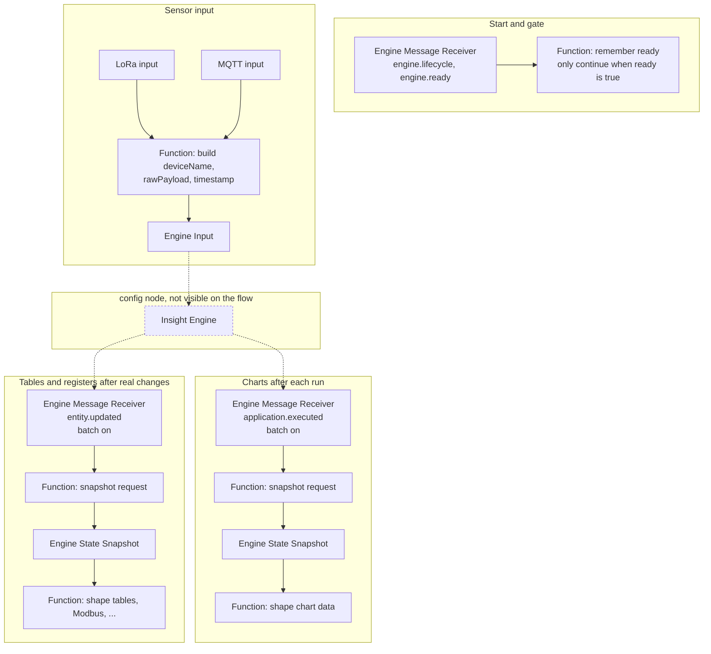

# Using the Insight Engine

This is a short book, not a full technical manual. If you can read it in one sitting, you should be able to open Node-RED, put the engine on a flow, and understand what happens when a sensor value arrives.

The story uses two plugins that already work in this package: the Enless twin-temperature device (`sxs.enless-twin-temp`) and the twin-temperature failed-closed application (`sxs.twin-temp-failed-closed`). They are here only to show typical engine behaviour. Think of steam on the outlet of a steam-to-water heat exchanger. One temperature sensor sits on the steam inlet. The second sits on the outlet, upstream of the steam trap. The application looks at both temperatures and decides whether the trap fails to evacuate condensate properly from the heat exchanger.

You do not need to read the source code to follow this.

## 1. What the engine is for

The Insight Engine sits between raw sensor messages and the rest of your plant picture. Its main job is to give you **real-time insights**: a sensor value arrives, the engine checks it, applications run, and you see the result for *now*.

The engine can keep a short history in datastream buffers. That history is a convenience, not a historian. It lets you put incoming radio or MQTT traffic on one flow, and application work on another, without tying those two moments together. Some applications also need a little past data so they can use a rolling window and smooth the numbers they work with. That is what `sxs.twin-temp-failed-closed` does when it averages temperatures over `windowSizeMs`.

The result of an application run is still tied to the time when that run happened. So `maxBufferAgeMs` should stay close to "now". If the buffer is allowed to keep hours of old samples, the calculation may look current while it is really looking at a distant past.

Around that, the engine checks that values still arrive on time, runs calculations on a timer, and tells the rest of Node-RED when something changed. It does not draw charts. It does not write Modbus registers. It does not speak LoRa or MQTT by itself. It owns the model, the timers, the saved state, and the events. Your flow does the rest: receive radio or MQTT messages, convert them into a simple envelope, send that envelope into the engine, listen for events, read a snapshot, then update dashboards, tables, or protocol maps.

The package is built for Node.js 18 and Node-RED 3.0.2. On a small industrial gateway you may also meet npm 6.14.9. Install the packed palette file (`node-red-contrib-sxs-industrial`) through **Manage palette**. After a restart you should see four node types:

- Insight Engine
- Engine Input
- Engine Message Receiver
- Engine State Snapshot

The engine itself is not tied to Node-RED. The same core can run in a normal Node.js program. If you ever do that, you create an Engine, register the same plugins, feed it values, and listen to the same events. This guide stays with Node-RED, because that is where most people will first use the package.

### Plugins

A plugin is a small installed piece that knows one kind of device or one kind of calculation. The engine does not guess plugins from files on disk. The palette already contains a fixed list.

The name you type in configuration is the type id, not the pretty title. Type ids look like `sxs.something`. The first part is a short owner prefix. The rest is the product or the calculation.

At the moment these are the type ids you can put in the JSON configuration:

- `sxs.enless-twin-temp`
- `sxs.ecobolt2`
- `sxs.twin-temp-failed-closed`
- `sxs.ecobolt2-failed-open`

If you type a type that is not in that list, the engine fails to start. Later packages may add more plugins. Writing a new plugin is a later topic. For now, use only the ids above.

## 2. The four things the engine works with

Imagine a small plant sketch.

A **Device** is a real box in the field, or at least one logical sensor package. In our story that box is an Enless transmitter. It has a type, optional settings, and one or more named streams of numbers.

A **Datastream** is one of those streams. For Enless, the plugin always offers `temp1` and `temp2`. A datastream keeps a short history of values, remembers when the last good value arrived, and can raise an alarm if values stop arriving.

An **Asset** is the thing you care about as a plant object. Here it is the steam trap on that heat-exchanger outlet. An asset does not read sensors itself. It owns one or more applications and follows their results.

An **Application** is a calculation that belongs to an asset. Failed-closed needs two datafeeds, `tempIn` and `tempOut`. In configuration you map each datafeed to a device name and a datastream name. After that, the application can read those values on a timer and write a result such as Ok, Warning, or Undefined.

The names you write in JSON are the names people use. In this guide the device is `Diagnostic kit 19297`, the asset is `Trap 1`, and the application is `Failed closed`. Inside the engine those names become runtime ids. Spaces and many other characters are encoded, so `Diagnostic kit 19297` plus stream `temp1` becomes `Diagnostic%20kit%2019297/temp1`. The application under `Trap 1` becomes `Trap%201/Failed%20closed`. When you later ask for a snapshot, you use those runtime ids, not the pretty names.

### How a value travels

A LoRa or MQTT message arrives in Node-RED. A Function node turns it into this envelope and sends it to Engine Input:

```js
msg.payload = {
  deviceName: 'Diagnostic kit 19297',
  rawPayload: { sensorType: 12, temp1: 25.6, temp2: 45.3 },
  timestamp: 1787328000000,
};
return msg;
```

`deviceName` must match a name in your engine configuration. `rawPayload` is what the device plugin understands. For Enless it must be sensor type `12` and two finite numbers, `temp1` and `temp2`. `timestamp` is the time of the reading in milliseconds since 1970.

Engine Input has no output. If the envelope is broken, the engine raises a common diagnostic such as `INVALID_INGEST_ENVELOPE`. If the name is unknown, it raises `DEVICE_NOT_RECOGNIZED`. If the engine is not ready yet, the input node either rejects the message or waits, depending on the **When not ready** setting.

In addition to these universal rules, different devices can have their own payload checks. For Enless twin-temp, the two temperatures must sit between -100 and 400. A bad value is never stored in the buffer. The device setting `numFaultyValues` only delays the `SENSOR_BROKEN` alarm; the default is three bad values in a row. Until that count is reached, the plugin stays quiet and still does not keep the bad number. A good value is stored in the datastream buffer.

That buffer is a short list of `{ timestamp, value }`. It has a maximum length and a maximum age. Old samples fall out. Each datastream also has `expectedIntervalMs`, which says how often a new reading should arrive. The datastream itself is passive. It does not wake up on its own and ask "am I stale?". Something outside must pull its sleeve and run an update check. If the datastream is receiving data, a new accepted or rejected reading already triggers that update. If the datastream is mapped to an application, the application also asks for an update just before it runs. That covers the usual case. The hard case is a datastream that has had no data for hours and is either mapped to nothing, or mapped to an application that runs only once a day. Then neither new data nor an application run will pull the sleeve. For that reason the engine has a spare timer. If no update has happened for `expectedIntervalMs * intervalMarginCoefficient`, that spare mechanism runs `datastream.update`. The coefficient defaults to `1.5`. So if you expect a value every 100 seconds, the spare check waits about 150 seconds after the last update, not because "no data" is defined as 150 seconds, but because that is how long the engine will wait before it forces an update when nothing else did.

Applications do not read the raw LoRa message. When the application timer fires, the application takes data from the attached datastream buffers, using its own window (`windowSizeMs` in this example). One datastream can feed many applications, and each application decides how much of that buffer it wants. One may need the last ten seconds. Another may need a whole minute. That is why you must set `maxBufferAgeMs` large enough for every application that reads the stream, but still close enough to now that the insight stays real-time.

Some applications ask for every sample as a list. Many only need an average, which is what `sxs.twin-temp-failed-closed` does. Another common case is the latest sample. That is why a datastream offers `lastValue` and `averageValue`. If you later write your own application plugin, you can still read the whole buffer and use the samples in any way you need.

So `sxs.twin-temp-failed-closed` takes averaged values from the two mapped buffers. Those averages are the datafeed values. If both averages exist, the plugin compares them. If outlet is clearly warmer than inlet, it reports an application error. If inlet is below the off threshold, the trap is treated as off. If the inlet-minus-outlet difference is too large, it reports a failed-closed warning on the asset. Otherwise it reports Ok.

### What `evaluate` is allowed to return

You will not write a plugin today, but you will read application state, so the shape of the result matters. Every run returns four common fields plus the plugin's own state:

- `currState`: `0` Undefined, `1` Ok, `2` Warning, `3` Error
- `noDataError`: missing required data
- `appError`: the calculation itself failed
- `pluginState`: extra fields, for failed-closed that is `operState`, `tempInAvg`, and `tempOutAvg`

If the plugin throws, the engine finishes the run with `currState = 0`, `noDataError = false`, and `appError = true`. Plugins must not invent "clear" messages full of empty fields. They report problems through a small reporter, and the engine decides what to raise, update, or clear.

Those common application fields are not only for the application itself. Every asset has a `currState` that shows whether the plant object is in trouble right now. The attached applications decide what counts as trouble. The asset takes the strongest child `currState` (Undefined, Ok, Warning, or Error). It also sets `childrenError` when any child has `noDataError` or `appError`. Failed-closed adds its own `operState` in plugin state. That extra field belongs only to this application. Other applications may add different extra fields. They all still share `currState`, `noDataError`, and `appError`, and those three still drive the parent asset.

Devices work in a similar pair. A device can raise its own hardware problems. Ecobolt2 does this when status bits say the temperature sensor is bad, the external sensor is bad, or the device is unconfigured. Those device errors set device `hwError` and, in that example, stop all datastream updates for that payload. At the same time each datastream can have its own `noDataError` and `hwError`. If any child stream is in error, the device shows `childrenError`. The device is in error if it has its own hardware error or any child error.

### Grace period, so startup is not an alarm storm

Right after start, buffers are empty. That is normal. You do not want `NO_DATA` in the first seconds.

For a **datastream**, empty buffer plus overdue interval is not enough during the first grace window. Grace is `expectedIntervalMs * gracePeriodCoefficient`. The coefficient defaults to `2`. If you expect data every 100 seconds and keep the default, the engine waits at least 200 seconds before an empty stream becomes a `NO_DATA` error. Those 200 seconds start from the beginning of the current session. Each press of **Deploy** starts a new session, and that session has its own `sessionStartTimestamp`. If `NO_DATA` was already active in saved state, it stays active during that wait.

For an application, it is up to the plugin author whether to provide a grace period. It is strongly recommended, for the same reason as for datastreams: you do not want a `NO_DATA` error the moment a new session starts. That is why `sxs.twin-temp-failed-closed` has this mechanism. If averages are missing, it stays quiet until either the window length has passed since session start, or `noDataError` was already true from an earlier run. Only then does it raise application `NO_DATA`. That is why a trap does not go red the moment you deploy the flow.

### When the engine says "updated" and when it only says "executed"

Every time a due application run finishes, the engine emits `application.executed`. That event always comes. Its data tells you `success`, `resultChanged`, `lastRunTimestamp`, and `lastUpdateTimestamp`.

`entity.updated` is stricter. For an application it appears only when the result really changed: `currState`, `noDataError`, `appError`, or `pluginState`. A run that calculated the same Ok as last time still emits `application.executed`, but not `entity.updated`.

If the application result did change, the parent asset is asked to recompute. The asset may then emit its own `entity.updated`. Datastreams emit `entity.updated` when a sample is accepted, when input is rejected, or when stale check changes their state. Devices emit `entity.updated` when their own error flags or child-error picture changes.

A practical split in Node-RED is:

- listen to `application.executed` when you want charts that should move even if the process state stayed Ok
- listen to `entity.updated` when you want tables, Modbus maps, or other "something actually changed" views

If the result changed, you get `entity.updated` first, then `application.executed`.

### Diagnostics

A diagnostic is a named problem the engine wants you to see: `NO_DATA`, `SENSOR_BROKEN`, `INVALID_INGEST_ENVELOPE`, `TEMP_OUT_ABOVE_IN`, `FAILED_CLOSED`, and so on. It is not the full state of the trap. It is an alarm or notice attached to a source.

The engine, not your Function node, owns the life of these notices. You will see:

- `diagnostic.raised` — this problem appeared
- `diagnostic.updated` — the same problem is still there, but the text, severity, or details changed
- `diagnostic.cleared` — this problem is gone
- `diagnostic.notified` — a one-shot notice that is not kept as a lasting condition

If the same active condition is seen again with the same text, the engine may count it internally and stay quiet. Your flow should treat raised / updated / cleared as the story of lasting problems, and should not try to invent matching "clear" payloads.

The Insight Engine node itself does not send these messages on an output pin. It owns the engine. Engine Message Receiver is the node that turns engine events into Node-RED messages.

## 3. The Node-RED nodes and a small flow

You work with four nodes from this package, plus normal Node-RED nodes around them.

**Insight Engine** is a configuration node. Create one, paste JSON, choose a context store, and point the other three nodes at it.

**Engine Input** is the only door for sensor values. Put a Function node in front of it to build the envelope shown above.

**Engine Message Receiver** listens to event names and sends Node-RED messages. It has no input. Several receivers can watch the same engine with different patterns.

**Engine State Snapshot** answers a question: "give me the current state of these things". You must put the question on `msg.snapshotRequest` before this node. It then adds `msg.snapshot` and passes the same message on.

A useful first layout looks like this:



The ingest line in that picture goes through Engine Input, not through a message receiver. The receiver only listens. It never deposits sensor values.

### Lifecycle, ready, and session start

The engine is not useful until it has built devices, assets, restored saved state, and opened its timers. While that happens it is `starting`. When the work is done it becomes `ready`. It can also be `resetting`, `failed`, or `stopping`. Only `ready` means `ready: true`. Every other state means `ready: false`.

A lifecycle message looks like this:

```json
{
  "topic": "engine.lifecycle",
  "event": {
    "type": "engine.lifecycle",
    "timestamp": 1788100000000,
    "source": { "engineId": "the-node-red-id-of-your-engine" },
    "data": {
      "state": "ready",
      "ready": true,
      "sessionId": "1788100000000",
      "sessionStartTimestamp": 1788100000000,
      "cleanSession": false
    }
  }
}
```

When the engine enters `ready`, you also get a shorter `engine.ready` event with the same `ready: true` data. After you see `ready: true`, you can initialise the rest of your application: set Modbus registers, fill log tables or graphs with starting values, and so on. `sessionStartTimestamp` is the start of this living session. Grace periods and the first application wait are measured from that time, not from the last reboot of the gateway in some other sense.

<a id="clean-session"></a>`cleanSession` is true only when you asked for a one-shot wipe in the engine editor. That wipe erases the retained engine snapshot from memory or disk storage, so the next session starts from scratch with all buffers empty. Node-RED does not offer a true one-shot control, so the corresponding checkbox on the Engine settings page may already be checked. In that case uncheck it, check it again, press **Update**, and redeploy the flow.

Listen to `engine.lifecycle`, not only to `engine.ready`. You need the closing of the gate as well as the opening. When a receiver connects, it immediately repeats the current lifecycle event. That is important, because Node-RED may create your receiver after the engine already became ready.

Keep the ready flag in ordinary flow or global memory. Do not save it in the engine context store. A restored `true` after restart would be a lie: the new process is not ready until the new engine says so. In the init Function node, treat anything other than exactly `true` as not ready.

On an empty or cleaned session, each application waits one full `runIntervalMs` before the first evaluation. After a normal restart, restored applications keep their last-run time, so overdue work runs once. Missed intervals are not replayed one by one.

### Engine Message Receiver settings

You choose the engine, the event patterns, and whether to batch.

Patterns are a comma or line list. Useful ones:

- `engine.lifecycle, engine.ready` for the gate
- `application.executed` for chart refresh
- `entity.updated` for tables and registers
- `diagnostic.*` for alarm traffic
- `*` for everything, which is noisy

Without batch, every matching event becomes one Node-RED message, in the order the engine published them.

With batch, the first matching event opens a window (1000 to 10000 milliseconds, default 1000). At the end of that window the node sends one message with topic `engine.event-batch`. Inside `msg.event.data.events` you find every matching event in arrival order. The buffer holds 2 to 100 events, default 100. If more arrive, the oldest are dropped and `droppedEventCount` tells you how many were lost.

Batch does **not** merge events. If the same application updates twice in the window, you still have two events in the list. Nothing is joined, rewritten, or reduced to "latest only" when the events are collected. That is what "no coalescing" means here. Batch is only a short waiting box so your snapshot Function can ask for several ids at once. Getting a snapshot is a costly operation. Batching helps you avoid doing it on every incoming message.

Lifecycle and diagnostic edges are easy to miss if you only use a batched receiver. Keep an immediate receiver for `engine.lifecycle` and, if you care about alarms as they happen, for `diagnostic.*`.

A batched output looks like this:

```json
{
  "topic": "engine.event-batch",
  "event": {
    "type": "engine.event-batch",
    "data": {
      "droppedEventCount": 0,
      "events": [
        {
          "type": "entity.updated",
          "source": {
            "entityType": "application",
            "entityId": "Trap1/TwinTempFailedClosed"
          }
        }
      ]
    }
  }
}
```

### How to ask for a snapshot

Engine State Snapshot never guesses what you want. A Function node in front of it must set `msg.snapshotRequest`. The request needs at least one of `entities` or `diagnostics`. Each selector needs a `type` and `ids`.

Entity types are `device`, `datastream`, `asset`, and `application`. Diagnostic types are the same, plus `common`. `ids` is one runtime id, a list of ids, or `'*'` for all ids of that type. You cannot put `*` in `type`.

Suppose two applications have just been updated, with ids `Trap1/TwinTempFailedClosed` and `Trap2/TwinTempFailedClosed`. A request for those two applications is:

```js
msg.snapshotRequest = {
  entities: [
    {
      type: 'application',
      ids: ['Trap1/TwinTempFailedClosed', 'Trap2/TwinTempFailedClosed'],
    },
  ],
};
return msg;
```

If you also want the datastreams mapped to their datafeeds, add `datafeeds: true`:

```js
msg.snapshotRequest = {
  entities: [
    {
      type: 'application',
      ids: ['Trap1/TwinTempFailedClosed', 'Trap2/TwinTempFailedClosed'],
      datafeeds: true,
    },
  ],
};
return msg;
```

The engine then includes `tempIn` and `tempOut` streams next to the applications. You can also ask for `parent: true` to pull the asset, or `children: true` when you start from a device or an asset. `statePaths` limits the copied state, for example `['currState', 'hasError']`. Missing paths are skipped. If one selector asks for full state and another asks for a few paths of the same entity, you get the full state.

Diagnostics are a separate list. They do not take `parent`, `children`, `datafeeds`, or `statePaths`:

```js
msg.snapshotRequest = {
  entities: [
    {
      type: 'application',
      ids: ['Trap1/TwinTempFailedClosed', 'Trap2/TwinTempFailedClosed'],
      datafeeds: true,
      parent: true,
    },
  ],
  diagnostics: [
    {
      type: 'application',
      ids: ['Trap1/TwinTempFailedClosed', 'Trap2/TwinTempFailedClosed'],
    },
    { type: 'datastream', ids: '*' },
  ],
};
return msg;
```

A bad request, or an unknown id, is an error. The snapshot node then sends nothing.

If your receiver is in batch mode, collect ids from `msg.event.data.events`. If it is not, use `msg.event.source.entityId`. In real flows, remember encoding: a name with spaces will not be `Trap 1 - full/...` in the request. It will be `Trap%201%20-%20full/...`.

### What a snapshot looks like

The output always has `msg.snapshot.entities` and `msg.snapshot.diagnostics`. The group keys are always present, even when empty:

```json
{
  "entities": {
    "device": {},
    "datastream": {},
    "asset": {},
    "application": {}
  },
  "diagnostics": {
    "common": {},
    "device": {},
    "datastream": {},
    "application": {},
    "asset": {}
  }
}
```

Only the things you asked for are filled. If you requested one application and one datafeed, you might see:

```json
{
  "entities": {
    "device": {},
    "asset": {},
    "application": {
      "Trap1/TwinTempFailedClosed": {
        "entityType": "application",
        "entityId": "Trap1/TwinTempFailedClosed",
        "pluginType": "sxs.twin-temp-failed-closed",
        "extra": { "modbus": { "registers": { "currState": 27 } } },
        "relationships": {
          "parent": { "kind": "asset", "id": "Trap1" },
          "children": [],
          "datafeeds": {
            "tempIn": { "kind": "datastream", "id": "Device1/temp1" },
            "tempOut": { "kind": "datastream", "id": "Device1/temp2" }
          }
        },
        "state": {
          "currState": 1,
          "noDataError": false,
          "appError": false,
          "hasError": false,
          "pluginState": {
            "operState": 2,
            "tempInAvg": 90.1,
            "tempOutAvg": 70.4
          }
        }
      }
    },
    "datastream": {
      "Device1/temp1": {
        "entityType": "datastream",
        "entityId": "Device1/temp1",
        "state": {
          "noDataError": false,
          "hwError": false,
          "hasError": false,
          "samples": [{ "timestamp": 1787328000000, "value": 90.1 }]
        }
      }
    }
  },
  "diagnostics": {
    "common": {},
    "device": {},
    "datastream": {},
    "application": {},
    "asset": {}
  }
}
```

Every entity state includes `hasError`. Device and asset states also include `childrenError`. If you put `extra` on that entity in configuration, it comes back beside `state`, not inside it. The snapshot is plain data. It never contains live engine objects.

After the snapshot node, your Function node can copy `currState` into a chart, a table, or a Modbus write. That last mapping is your flow, not this package.

## 4. The JSON inside the Insight Engine node

The configuration is one JSON object. `devices` and `assets` are required. Everything else is optional.

### A small configuration that already runs

This is enough to start, because missing numbers are filled from plugin defaults and from core fallbacks:

```json
{
  "devices": {
    "Device 3 - defaults": { "type": "sxs.enless-twin-temp" }
  },
  "assets": {
    "Trap 3 - defaults": {
      "applications": {
        "Failed closed - defaults": {
          "type": "sxs.twin-temp-failed-closed",
          "datafeeds": {
            "tempIn": { "device": "Device 3 - defaults", "datastream": "temp1" },
            "tempOut": { "device": "Device 3 - defaults", "datastream": "temp2" }
          }
        }
      }
    }
  }
}
```

That is a teaching minimum, not a plant design. Core fallbacks for a datastream are buffer length `10`, buffer age `600000` ms, and expected interval `60000` ms. An application without `runIntervalMs` runs every `600000` ms. Enless gets `numFaultyValues: 3`. Failed-closed gets its plugin defaults: `tempDiffMargin` 0.5, `offThreshold` 80, `tempDiffThreshold` 30, `windowSizeMs` 1800000. Replace those timings with the real reporting interval of your transmitter before you trust the result.

### A full configuration, and what happens when you crop it

The Insight Engine editor template shows three layers of the same story: a fully written device and application, a partly written pair, and a pair that lives on defaults. A shortened picture of that idea is:

```json
{
  "applicationScheduler": { "batchSize": 3, "failureRetryDelayMs": 1000 },
  "datastreamStaleScheduler": { "batchSize": 3, "failureRetryDelayMs": 1000 },
  "applicationDefaults": {
    "sxs.twin-temp-failed-closed": {
      "runIntervalMs": 600000,
      "settings": {
        "tempDiffMargin": 0.5,
        "offThreshold": 80,
        "tempDiffThreshold": 30,
        "windowSizeMs": 1800000
      },
      "datafeedDatastreams": {
        "tempIn": {
          "maxBufferLength": 5,
          "maxBufferAgeMs": 1800000,
          "expectedIntervalMs": 600000,
          "gracePeriodCoefficient": 2
        },
        "tempOut": {
          "maxBufferLength": 5,
          "maxBufferAgeMs": 1800000,
          "expectedIntervalMs": 600000,
          "gracePeriodCoefficient": 2
        }
      }
    }
  },
  "deviceDefaults": {
    "sxs.enless-twin-temp": {
      "settings": { "numFaultyValues": 3 },
      "datastreams": {
        "temp1": {
          "maxBufferLength": 8,
          "maxBufferAgeMs": 600000,
          "expectedIntervalMs": 100000
        },
        "temp2": {
          "maxBufferLength": 8,
          "maxBufferAgeMs": 600000,
          "expectedIntervalMs": 100000
        }
      }
    }
  },
  "devices": {
    "Device 1 - full": {
      "type": "sxs.enless-twin-temp",
      "extra": { "modbus": { "registers": { "childrenError": 205 } } },
      "datastreams": {
        "temp1": {
          "maxBufferLength": 6,
          "maxBufferAgeMs": 60000,
          "expectedIntervalMs": 10000,
          "extra": { "modbus": { "registers": { "value": 301 } } }
        },
        "temp2": {
          "maxBufferLength": 6,
          "maxBufferAgeMs": 60000,
          "expectedIntervalMs": 10000
        }
      }
    },
    "Device 2 - partial": {
      "type": "sxs.enless-twin-temp",
      "settings": { "numFaultyValues": 5 },
      "datastreams": { "temp1": { "maxBufferLength": 9 } }
    },
    "Device 3 - defaults": { "type": "sxs.enless-twin-temp" }
  },
  "assets": {
    "Trap 1 - full": {
      "extra": { "modbus": { "registers": { "childrenError": 401 } } },
      "applications": {
        "Failed closed - full": {
          "type": "sxs.twin-temp-failed-closed",
          "extra": { "modbus": { "registers": { "currState": 27 } } },
          "runIntervalMs": 120000,
          "settings": {
            "tempDiffMargin": 0.4,
            "offThreshold": 70,
            "tempDiffThreshold": 40,
            "windowSizeMs": 180000
          },
          "datafeeds": {
            "tempIn": { "device": "Device 1 - full", "datastream": "temp1" },
            "tempOut": { "device": "Device 1 - full", "datastream": "temp2" }
          }
        }
      }
    }
  }
}
```

`Device 2 - partial` only overrides what it cares about. `Device 3 - defaults` writes only the type. The same idea applies to applications: you must always give `type` and `datafeeds`; settings and `runIntervalMs` can be omitted.

The two scheduler objects are optional. If you leave them out, each uses `batchSize` 3 and `failureRetryDelayMs` 1000. That batch size is how many applications or stale checks the engine tries in one turn. It is not the Node-RED receiver batch.

### How settings are merged

Plugin settings, such as `numFaultyValues` or `tempDiffMargin`, are built in this order:

1. defaults from the plugin itself
2. `deviceDefaults` or `applicationDefaults` for that type
3. the settings object on the concrete device or application

Application run interval:

1. core `600000`
2. `applicationDefaults[type].runIntervalMs`
3. the application's own `runIntervalMs`

Datastream retention is a longer chain:

1. core bootstrap: length `10`, age `600000`, expected interval `60000`
2. `deviceDefaults[type].datastreams[name]`
3. application datafeed defaults for every application that maps that stream
4. the explicit `devices[name].datastreams[name]` object, which wins

If several applications point at the same datastream, their datafeed defaults are combined in a fixed way: largest buffer length, largest buffer age, smallest expected interval, largest grace coefficient. Device-type datastream defaults also create streams even when no application maps them yet. `gracePeriodCoefficient` is optional and defaults to `2`.

After all of this merging, the engine checks the final numbers. A broken type, a missing datafeed, or a setting outside the plugin schema stops startup.

### The `extra` field

Any concrete device, datastream, asset, or application may contain `extra`. It is free-form JSON. The engine does not read it, does not save it in runtime state, and does not care if it holds Modbus register numbers, OPC UA node ids, or a comment for your future self. When you snapshot that entity, `extra` comes back so your table or protocol Function can stay next to the thing it describes.

## 5. Saving state, and what Node-RED must allow

The engine can remember buffers, last-run times, process state, and lasting diagnostics. Readiness is never saved. After restart, the engine always starts not-ready and says ready again only when the new session is actually up.

Saving uses Node-RED context storage. The Insight Engine node has a **Context store** field, default `ieps`. That name must exist in Node-RED `settings.js`. A typical durable setup is:

```js
contextStorage: {
  default: 'memoryOnly',
  memoryOnly: { module: 'memory' },
  ieps: {
    module: 'localfilesystem',
    config: { flushInterval: 300 }
  }
}
```

Restart Node-RED after you change this. Keep `flushInterval` between 60 and 300 seconds. A sudden power cut can still lose the last unwritten seconds.

If the field is empty, or `ieps` is missing, the engine warns and uses the Node-RED default store. That often means memory only, so a process restart will not bring the buffers back. But at least the engine context will be kept in memory when the **Deploy** button is pressed, which is not bad.

There is a sharper trap. If `contextStorage` in `settings.js` is fully commented out, Node-RED does not keep context even for a normal **Deploy**. You then lose deposited values as soon as you press Deploy, not only after a reboot. At the very least, turn on:

```js
contextStorage: {
  default: { module: 'memory' }
}
```

That memory store is enough to survive Deploy in the same process. It is not enough to survive a gateway reboot. In many cases, keeping the context in memory is still a viable option: gateway reboots do not happen often, while redeployments are much more typical. For reboot recovery, add the `ieps` filesystem store and select it on the engine node.

**Clean session** on the engine node wipes that engine's saved state once, on the next deploy, then turns itself off. Use it when you want a fresh start without deleting the node. How to tick the checkbox is explained earlier, in [Lifecycle, ready, and session start](#clean-session).

The engine's hidden id, not the pretty Name field, is the storage key. If you delete the config node, its saved namespace is removed after shutdown.

## A last walk through the steam trap

You install the palette on Node-RED 3.0.2. You enable at least a memory context store, better also `ieps`. You create an Insight Engine and keep the twin-temp template, then rename devices to match your radio. You add a lifecycle receiver and a Function that sets a ready flag. You convert LoRa or MQTT into `{ deviceName, rawPayload, timestamp }` and send it to Engine Input. Enless checks sensor type 12 and stores `temp1` and `temp2`. Those streams become `tempIn` and `tempOut` for failed-closed. After one run interval, the application evaluates. You listen to `application.executed` for charts and `entity.updated` for tables. You never read live objects from events. You ask for a snapshot, then you write your own chart or register mapping.

If you can follow that path without opening the source tree, the engine is doing what it was built to do.
